# 🎓 EducSteam — Plataforma Educativa de Juegos STEAM con Realidad Aumentada

<div align="center">


### *Explora, Aprende y Crea a través de la Ciencia, Tecnología, Ingeniería, Arte y Matemáticas*

[](https://react.dev/)
[](https://create-react-app.dev/)
[](https://reactrouter.com/)
[](#-tecnología-de-realidad-aumentada-ra)
[](#-catálogo-de-juegos-steam)
[](#)
[](#)

---

</div>

## 📌 Índice
1. [🌟 Visión General](#-visión-general)
2. [✨ Características Principales](#-características-principales)
3. [🏗️ Arquitectura y Esqueleto del Proyecto](#️-arquitectura-y-esqueleto-del-proyecto)
4. [🎮 Catálogo de Juegos STEAM](#-catálogo-de-juegos-steam)
   - [🔬 Ciencia (Science)](#-ciencia-science)
   - [💻 Tecnología (Technology)](#-tecnología-technology)
   - [⚙️ Ingeniería (Engineering)](#️-ingeniería-engineering)
   - [🎨 Arte (Arts)](#-arte-arts)
   - [📐 Matemáticas (Math)](#-matemáticas-math)
5. [🕶️ Tecnología de Realidad Aumentada (RA)](#-tecnología-de-realidad-aumentada-ra)
6. [🛠️ Stack Tecnológico](#️-stack-tecnológico)
7. [🚀 Instalación y Ejecución](#-instalación-y-ejecución)
8. [🔌 Guía para Desarrolladores: Cómo Agregar un Juego](#-guía-para-desarrolladores-cómo-agregar-un-juego)
9. [⚠️ Consideraciones Importantes (Gotchas)](#️-consideraciones-importantes-gotchas)

---

## 🌟 Visión General

**EducSteam** es una aplicación web interactiva diseñada en español que ofrece un catálogo interactivo al estilo **Steam** orientado a niños y jóvenes. Su propósito pedagógico central es impulsar el desarrollo de competencias del siglo XXI integrando el enfoque **STEAM** (*Science, Technology, Engineering, Arts, Math*) a través del aprendizaje gamificado y la incorporación de experiencias inmersivas con **Realidad Aumentada (RA)**.

> [!TIP]
> **EducSteam** conecta cada videojuego con una matriz pedagógica de competencias (pensamiento crítico, abstracción, codificación, resolución de problemas complejos, expresión estética y razonamiento cuantitativo).

---

## ✨ Características Principales

- 🎮 **Catálogo Multidisciplinario**: Más de 24 minijuegos educativos categorizados por áreas STEAM.
- 🕶️ **Experiencias con Realidad Aumentada (RA)**: Juegos seleccionados integran visión por cámara y marcadores 3D mediante **AR.js** y **Three.js**.
- 🧩 **Arquitectura Híbrida de Juegos**: Soporta tanto juegos modernos construidos como componentes React (`JSX`) como juegos clásicos HTML5 standalone (`iframe`/navegación estática).
- 📊 **Seguimiento de Competencias**: Mapeo transparente entre actividades y competencias adquiridas (*Skill Groups*).
- 📦 **Exportación y Descargas**: Módulo integrado para empaquetar y descargar los juegos en formato comprimido ZIP para uso offline.
- 🎨 **Interfaz Dinámica e Intuitiva**: Sidebar interactiva, navegación fluida, barras de progreso y diseño responsive adaptado para aulas e instituciones educativas.

---

## 🏗️ Arquitectura y Esqueleto del Proyecto

El proyecto está desarrollado sobre **React 19** utilizando **Create React App (`react-scripts`)** y **JavaScript / JSX plano**.

### 📐 Diagrama de Arquitectura de la Aplicación

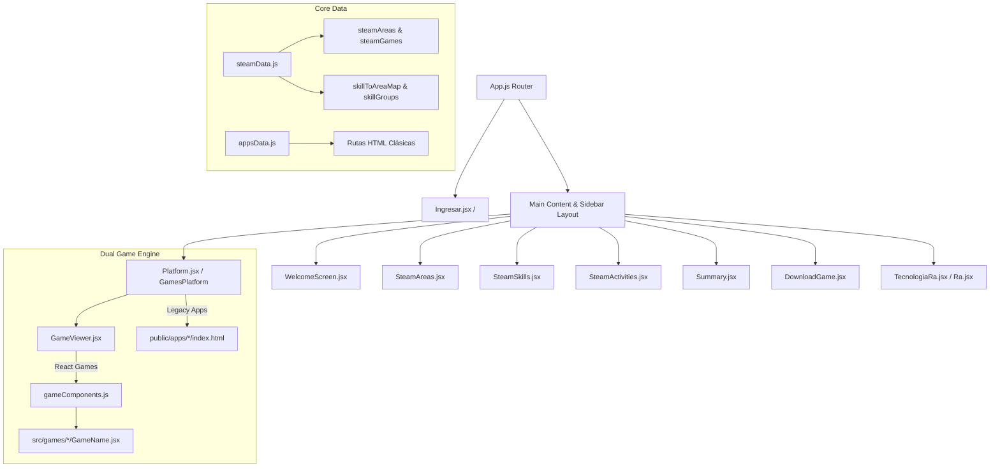

### 📁 Estructura del Árbol de Directorios

```text
educsteam/
├── public/
│   ├── apps/                    # 📦 Juegos HTML5 Standalone (Legacy)
│   │   ├── Acertijo/
│   │   ├── Ahorcado/
│   │   ├── BloqCode/
│   │   ├── CalculoMental/
│   │   ├── Crucigrama/
│   │   ├── DiagramasFlujo/
│   │   ├── Memorama/
│   │   ├── OdenadorIMG/
│   │   ├── Pixelart/
│   │   ├── Rompecabezas/
│   │   └── Sudoku/
│   ├── images/                  # 🖼️ Recursos Gráficos e Íconos
│   │   ├── areas/               # Animaciones Lottie JSON y miniaturas de áreas
│   │   └── juegos/              # Miniaturas e íconos de cada juego
│   └── index.html
├── src/
│   ├── components/              # 🧩 Componentes Principales de la UI
│   │   ├── Sidebar.jsx          # Navegación principal
│   │   ├── GamesPlatform.jsx    # Catálogo e interfaz de selección
│   │   ├── GameViewer.jsx       # Renderizador de juegos React
│   │   ├── SteamAreas.jsx       # Explorador por área STEAM
│   │   ├── SteamSkills.jsx      # Explorador por competencias
│   │   ├── SteamActivities.jsx  # Galería de actividades
│   │   ├── DownloadGame.jsx     # Descargador de juegos (JSZip)
│   │   ├── Summary.jsx          # Resumen de progreso
│   │   └── TecnologiaRa.jsx     # Módulo de explicación de RA
│   ├── data/                    # 🗃️ Configuraciones y Datos Centrales
│   │   ├── steamData.js         # Matriz STEAM, juegos, competencias y RA
│   │   ├── gameComponents.js    # Registro central de componentes React
│   │   └── appsData.js          # Metadatos de aplicaciones descargables
│   ├── games/                   # 🎮 Juegos Modernos Nativos React (JSX + CSS local)
│   │   ├── Acertijo/            ├── BioFlor/             ├── BloqCode/
│   │   ├── CalculoMental/       ├── CircuitSwap/         ├── Cromix/
│   │   ├── Crucigrama/          ├── DesarrolloAlgoritmos/├── DiagramasFlujo/
│   │   ├── DiseñoFractal/       ├── Encriptacion/        ├── GeometricArt/
│   │   ├── MagForce/            ├── Mandala/             ├── Memorama/
│   │   ├── Memoria/             ├── MinerMyst/           ├── OrdenarIMG/
│   │   ├── Rompecabezas/        ├── Stroop/              ├── Sudoku/
│   │   ├── Tangram/             └── TorresHanoi/
│   ├── styles/                  # 🎨 Hojas de Estilo CSS Centralizadas
│   │   ├── theme.css            # Tema de colores y variables globales
│   │   ├── screens.css          # Estilos de pantallas generales
│   │   └── progress.css         # Barra de progreso pedagógico
│   ├── App.js                   # Enrutamiento con React Router v6
│   └── index.js                 # Punto de entrada de la aplicación React
├── package.json                 # Dependencias y scripts
└── README.md                    # Documentación del proyecto
```

---

## 🎮 Catálogo de Juegos STEAM

Cada juego está diseñado para activar habilidades específicas del pensamiento crítico, computacional y creativo.

### 🔬 Ciencia (Science)

Estudio sistemático de fenómenos naturales mediante observación, metodología científica y experimentación.

| Juego | Icono / Vista Previa | Descripción Pedagógica | Habilidades Desarrolladas | Sistema |
| :--- | :---: | :--- | :--- | :---: |
| **BioFlor** |  | Simulación interactiva de botánica y crecimiento vegetal. Los estudiantes experimentan con variables biológicas. | • Metodología científica<br>• Observación y experimentación<br>• Razonamiento lógico | `React JSX` |
| **MinerMyst** | 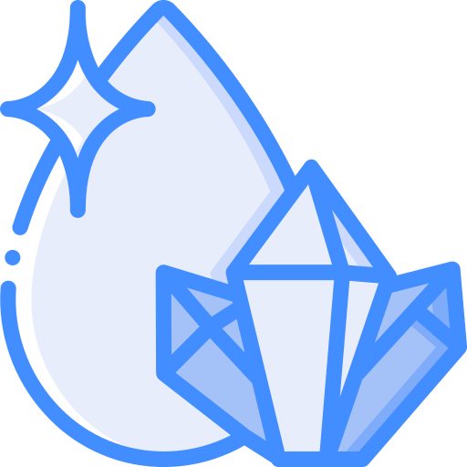 | Juego de exploración geológica para clasificar e identificar minerales según sus propiedades físicas y químicas. | • Análisis de datos<br>• Observación científica<br>• Pensamiento analítico | `React JSX` |
| **Cromix** | 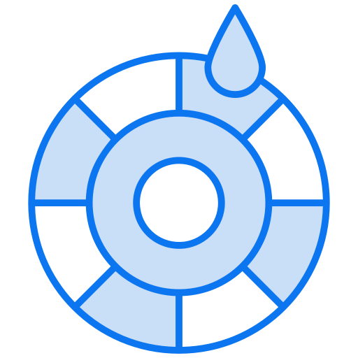 | Laboratorio de síntesis y combinación de luz y pigmentos cromáticos para comprender la física del color. | • Experimentación práctica<br>• Pensamiento crítico<br>• Análisis de propiedades | `React JSX` |
| **Rompecabezas** | 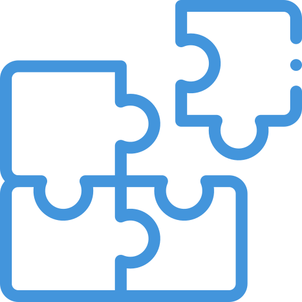 | Ensamblaje de imágenes científicas que ejercita la percepción espacial y el reconocimiento de patrones. | • Análisis visual<br>• Resolución de problemas<br>• Atención al detalle | `Híbrido` |
| **Ahorcado** | 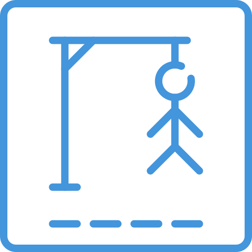 | Reto de vocabulario y términos científicos para reforzar el pensamiento deductivo e inferencial. | • Vocabulario técnico<br>• Pensamiento analítico<br>• Deducción lógica | `Híbrido` |
| **Acertijos** |  | Colección de problemas hipotéticos y dilemas de razonamiento lógico-científico. | • Metodología científica<br>• Análisis crítico<br>• Pensamiento abstracto | `Híbrido` |

---

### 💻 Tecnología (Technology)

Herramientas, algoritmos y ciberseguridad aplicados para resolver problemas del entorno digital moderno.

| Juego | Icono / Vista Previa | Descripción Pedagógica | Habilidades Desarrolladas | Sistema |
| :--- | :---: | :--- | :--- | :---: |
| **BloqCode** 🕶️ |  | Entorno de programación por bloques estilo Blockly con visualización 3D y marcadores en **Realidad Aumentada**. | • Codificación y lógica<br>• Alfabetización digital<br>• Creación tecnológica | `React + RA` |
| **Enkrypto** 🕶️ |  | Desafíos de cifrado y descifrado de códigos para comprender los fundamentos de la seguridad informática y ciberseguridad. | • Seguridad informática<br>• Lógica de cifrado<br>• Alfabetización digital | `React + RA` |
| **Desarrollo de Algoritmos** 🕶️ |  | Diseñador de secuencias de pasos algorítmicos ejecutados en entornos virtuales e interactivos de RA. | • Pensamiento computacional<br>• Estructura lógica<br>• Adaptabilidad tecnológica | `React + RA` |
| **Ordenamiento de Información** | 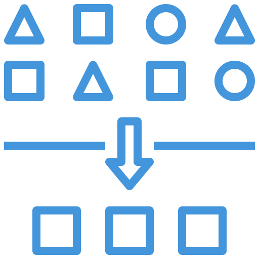 | Clasificación y estructuración lógica de datos e imágenes para entender bases de datos y secuencias. | • Manejo de información<br>• Razonamiento ordenado<br>• Comunicación digital | `Híbrido` |

---

### ⚙️ Ingeniería (Engineering)

Diseño, modelado y construcción de soluciones óptimas aplicando lógica y principios físicos.

| Juego | Icono / Vista Previa | Descripción Pedagógica | Habilidades Desarrolladas | Sistema |
| :--- | :---: | :--- | :--- | :---: |
| **CircuitSwap** |  | Simulador de circuitos eléctricos donde se reemplazan componentes para lograr la continuidad de corriente. | • Electrónica básica<br>• Modelado de soluciones<br>• Habilidades técnicas | `React JSX` |
| **MagForce** |  | Banco de pruebas sobre campos magnéticos, vectores de fuerza y atracción/repulsión entre polos. | • Principios físicos<br>• Resolución de problemas<br>• Construcción espacial | `React JSX` |
| **Torres de Hanoi** |  | Desafío matemático-espacial clásico para la comprensión de algoritmos recursivos y planificación. | • Pensamiento recursivo<br>• Planificación por pasos<br>• Optimización | `React JSX` |
| **Diagrama de Flujo** | 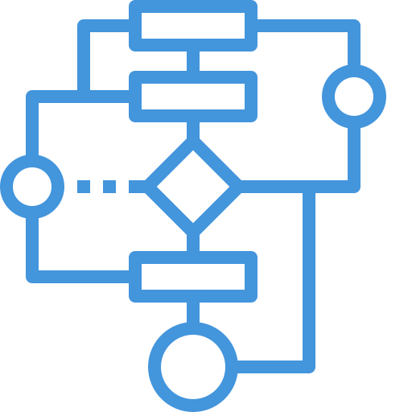 | Herramienta gráfica para estructurar procesos, decisiones y lógica de control sintáctica. | • Diagramación estructurada<br>• Ingeniería de procesos<br>• Lógica condicional | `Híbrido` |
| **Sudoku** | 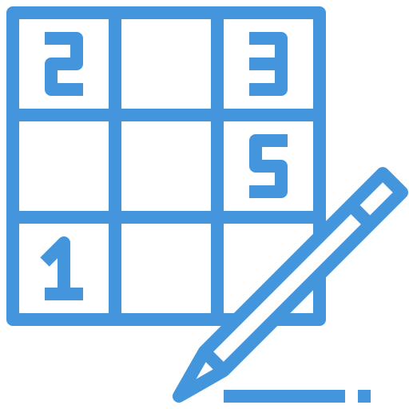 | Matriz lógica de restricciones numéricas que entrena la deducción sin solapamientos. | • Deducción sistemática<br>• Atención concentrada<br>• Lógica de restricciones | `Híbrido` |
| **Crucigrama** | 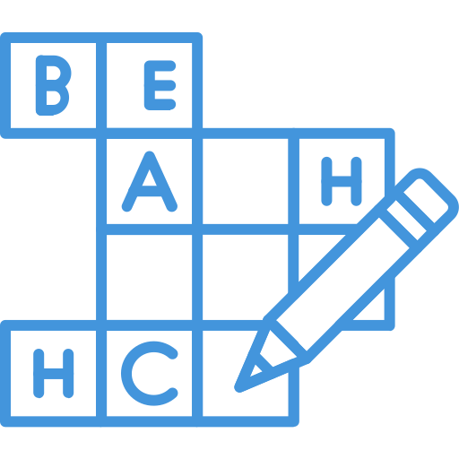 | Cruces semánticos de conceptos de ingeniería, mecanismos y arquitectura de materiales. | • Estructuración conceptual<br>• Asociación lógica<br>• Vocabulario técnico | `Híbrido` |

---

### 🎨 Arte (Arts)

Expresión creativa, diseño gráfico, geometría estética y percepción perceptivo-visual.

| Juego | Icono / Vista Previa | Descripción Pedagógica | Habilidades Desarrolladas | Sistema |
| :--- | :---: | :--- | :--- | :---: |
| **Mandala / Pixelart** |  | Lienzo de creación digital para explorar la simetría radial, la teoría cromática y el arte en píxeles. | • Creatividad gráfica<br>• Sensibilidad estética<br>• Expresión visual | `React JSX` |
| **Geometric Art** |  | Generador de composiciones artísticas basadas en polígonos, proporciones y transformaciones geométricas. | • Geometría estética<br>• Diseño estructurado<br>• Pensamiento innovador | `React JSX` |
| **Efecto Stroop** |  | Test perceptivo de interferencia semántico-cromática para entrenar la flexibilidad cognitiva y la velocidad de reacción. | • Agilidad mental<br>• Procesamiento visual<br>• Control inhibitorio | `React JSX` |
| **Memoria / Memorama** | 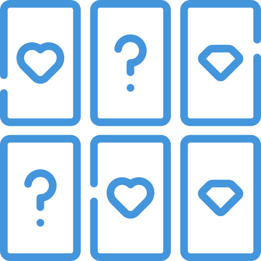 | Juego de retención e identificación de pares gráficos con narrativas y conceptos artísticos. | • Memoria de trabajo<br>• Asociación espacial<br>• Concentración visual | `React JSX` |

---

### 📐 Matemáticas (Math)

Razonamiento abstracto, operaciones numéricas, geometría y patrones cuantitativos.

| Juego | Icono / Vista Previa | Descripción Pedagógica | Habilidades Desarrolladas | Sistema |
| :--- | :---: | :--- | :--- | :---: |
| **Cálculo Mental** 🕶️ |  | Ejercitación aritmética interactiva contra reloj con interfaz adaptativa y soporte de Realidad Aumentada. | • Agilidad aritmética<br>• Razonamiento cuantitativo<br>• Precisión numérica | `React + RA` |
| **Diseño Fractal** | 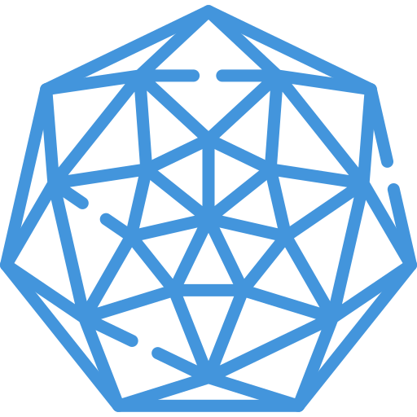 | Explorador de matemática recursiva, autosimilitud y geometría fractal en tiempo real. | • Geometría abstracta<br>• Modelado matemático<br>• Patrones infinitos | `React JSX` |
| **Tangram** |  | Puzzle tradicional chino de 7 piezas geométricas para desarrollar la descomposición de superficies y figuras. | • Geometría espacial<br>• Composición de áreas<br>• Pensamiento abstracto | `React JSX` |

---

## 🕶️ Tecnología de Realidad Aumentada (RA)

EducSteam incorpora la tecnología de **Realidad Aumentada web** directamente desde el navegador, sin necesidad de instalar aplicaciones externas adicionales.

```text
┌──────────────────────────────────────────────────────────┐
│                   Experiencia RA Web                     │
├─────────────────────────┬────────────────────────────────┤
│ 📷 Cámara Web / Móvil   │ Captura de video en vivo       │
│ 🎯 Marcadores (Pattern) │ Reconocimiento óptico de patrón│
│ 📦 AR.js Engine         │ Renderizado ligero sobre WebGL │
│ 📐 Three.js / Canvas    │ Modelos y animaciones 3D       │
└─────────────────────────┴────────────────────────────────┘
```

> [!NOTE]
> Los juegos marcados con la insignia 🕶️ (**BloqCode**, **Enkrypto**, **Desarrollo de Algoritmos** y **Cálculo Mental**) hacen uso activo del motor **AR.js** y **Three.js** para proyectar elementos interactivos sobre marcadores impresos o digitales.

---

## 🛠️ Stack Tecnológico

<div align="center">

| Categoría | Tecnologías Utilizadas |
| :--- | :--- |
| **Core Framework** | React 19, Create React App (`react-scripts` v5), JavaScript (ES6+) |
| **Enrutamiento** | React Router DOM v6 |
| **Librerías de UI** | Chakra UI, Material UI (MUI), Bootstrap 5, Bulma, Flowbite React |
| **Iconografía & Gráficos** | FontAwesome, RemixIcon, Lucide React, React Icons, Flat Color Icons |
| **Gráficos 2D / 3D & Canvas** | Fabric.js, Konva.js, React-Konva, Three.js |
| **Realidad Aumentada** | AR.js (WebGL / WebXR) |
| **Animación** | Framer Motion, Lottie Files (`@lottiefiles/react-lottie-player`) |
| **Utilidades & Archivos** | JSZip, File-Saver, SweetAlert2, Blockly Engine |

</div>

---

## 🚀 Instalación y Ejecución

### 📋 Requisitos Previos
- **Node.js**: Versión 16.x o superior.
- **npm**: Versión 8.x o superior.

### 🔧 Pasos de Instalación

1. **Clonar o situarse en la carpeta del repositorio:**
   ```bash
   cd f:\educsteam
   ```

2. **Instalar dependencias:**
   ```bash
   npm install
   ```

3. **Iniciar el servidor de desarrollo:**
   ```bash
   npm start
   ```
   La aplicación se abrirá automáticamente en `http://localhost:3000`.

4. **Ejecutar pruebas unitarias:**
   ```bash
   npm test -- --watchAll=false
   ```

5. **Construir el paquete para producción:**
   ```bash
   npm run build
   ```

---

## 🔌 Guía para Desarrolladores: Cómo Agregar un Juego

Para integrar un nuevo juego nativo en React a la plataforma EducSteam, debes registrarlo en **4 puntos clave**:

> [!IMPORTANT]
> El identificador del juego (`id`) debe coincidir exactamente en todas las referencias.

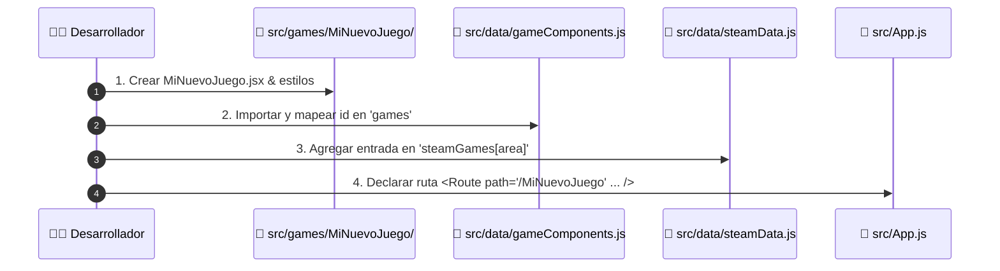

### 1️⃣ Crear el Componente del Juego
Crea un nuevo directorio en `src/games/MiNuevoJuego/` con su componente principal:
```jsx
// src/games/MiNuevoJuego/MiNuevoJuego.jsx
import React from 'react';
import './MiNuevoJuego.css';

export default function MiNuevoJuego() {
  return (
    <div className="game-container">
      <h2>🎮 ¡Mi Nuevo Juego STEAM!</h2>
    </div>
  );
}
```

### 2️⃣ Registrar en `gameComponents.js`
Añade la importación y la entrada en el mapa de componentes:
```javascript
// src/data/gameComponents.js
import MiNuevoJuego from '../games/MiNuevoJuego/MiNuevoJuego';

export const games = {
  // ... juegos existentes
  MiNuevoJuego: <MiNuevoJuego />,
};
```

### 3️⃣ Definir Metadatos en `steamData.js`
Agrega el objeto del juego en el área correspondiente (`science`, `technology`, `engineering`, `arts` o `math`):
```javascript
// src/data/steamData.js
export const steamGames = {
  technology: {
    // ...
    'MiNuevoJuego': {
      id: 'MiNuevoJuego',
      name: 'Mi Nuevo Juego',
      icon: "/images/juegos/minuevojuego.png",
      path: '/apps/MiNuevoJuego/index.html',
      skills: [
        'Programación y codificación',
        'Alfabetización digital'
      ]
    }
  }
};
```

### 4️⃣ Configurar la Ruta en `App.js`
Registra la ruta de navegación en el router principal:
```jsx
// src/App.js
import MiNuevoJuego from './games/MiNuevoJuego/MiNuevoJuego';

// Dentro de <Routes>:
<Route path="/MiNuevoJuego" element={<>
  <ProgressBar />
  <MiNuevoJuego />
</>} />
```

---

## ⚠️ Consideraciones Importantes (Gotchas)

> [!CAUTION]
> **Gestión de Git y Control de Versiones**:
> El repositorio actualmente realiza seguimiento a carpetas de salida como `node_modules/`, `build/` y `build.zip`. Nunca ejecutes `git add .` a ciegas. Modifica y añade **únicamente** los archivos fuente específicos que hayas creado o actualizado.

- 🔤 **Codificación de Caracteres (UTF-8)**: Algunos archivos heredados contienen caracteres corruptos de tildes o eñes de scripts anteriores. Asegúrate de guardar siempre tus archivos en codificación **UTF-8**.
- 🛠️ **Scripts de Modificación en la Raíz**: Los archivos `.js` ubicados en la raíz (`update_all.js`, `transform.js`, `script.js`, etc.) son herramientas de refactorización temporales pasadas. No forman parte del flujo de compilación oficial.
- 🎨 **Estilos CSS**: La hoja de estilos principal activa se encuentra dentro del directorio `src/styles/`. Edita prioritariamente allí en lugar de los archivos legacy en `src/*.css`.

---

<div align="center">

**Desarrollado con ❤️ para la educación pública e innovadora en la era digital.**  
*© EducSteam Project — Desarrollado con React 19 y tecnología STEAM.*

</div>
